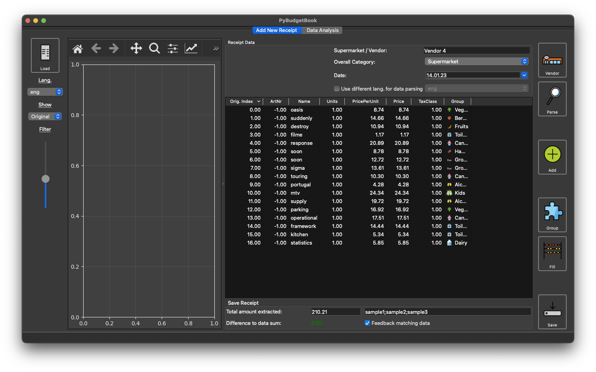
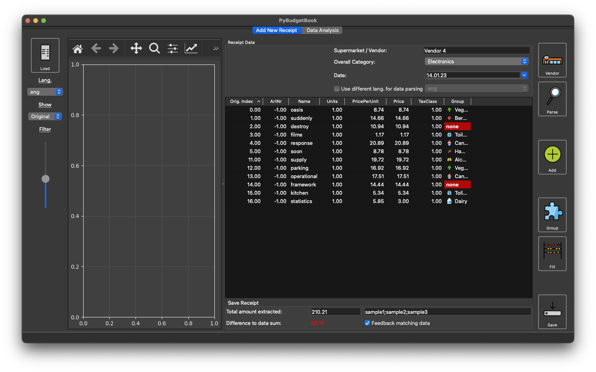
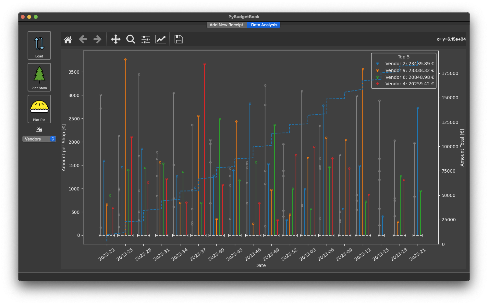
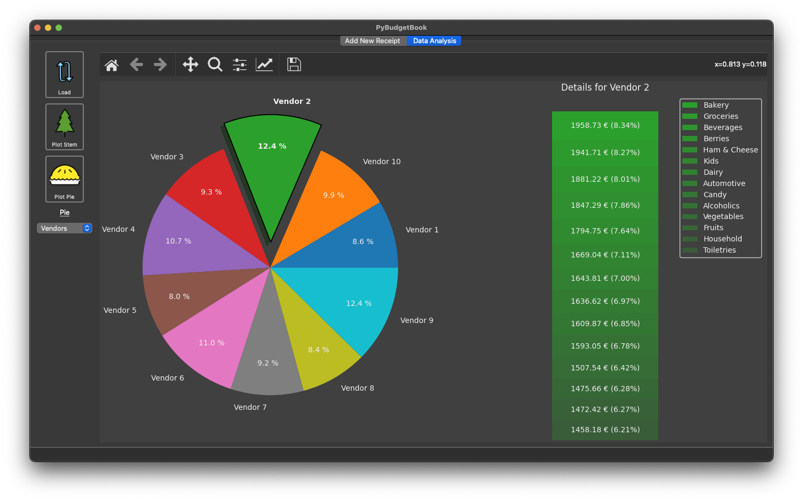
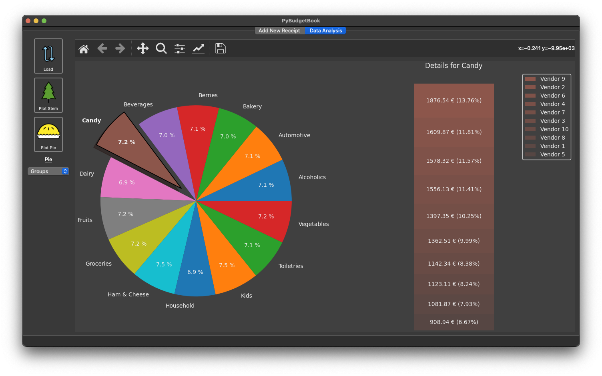

# pybudgetbook
Organize and sort your receipts locally, use pandas power to analyze your
expenses!
But why? There are tons of Apps out there scanning and even some for receipts.
Some of them might even be more general or better at parsing. Sure, but here are
the core reasons why I built this app. If they are important to you, give it a
try (and help to support more receipts)!

Reason 1: Data Privacy

Your receipts combined with some personal data are a pretty good estimator on
where you are and what you are doing. I prefer to keep that data locally. This
software will never *access and send* any of that data since it runs locally.

Reason 2: Adaptability

Receipts differ for region and even for supermarkets. Here, some of the more
common german stores are included. If something does not work, add your own
reader / parser!

Reason 3: Data Analysis

The data is saved in `hdf`-files for `pandas` and can be easily exported to
`csv` or any other format manually. So analysis is not limited to the few plots
available (even though the initial version has some important ones). You can
easily load all your data using a simple one-liner and run all the analysis you
want. If you find anything particular useful, let me know and I can implement
that.

Uses some icons from [Yusuke Kamiyamane](http://p.yusukekamiyamane.com/)

Some emojis / icons designed by OpenMoji – the open-source emoji and icon
project. License: CC BY-SA 4.0

## Current State of Functionality and Roadmap
- Prepare receipt images for `tesseract` including manual rotation
- Parse receipts from (german) supermarkets and read items
- Sort data into receipt specific categories and item specific groups
- Correct items, add important metadata
- Save receipts and organize them in a dedicated folder.
- Basic data analysis with plots
- Export data to various formats

Future

- More types of receipts and more languages
- Better analysis tools and more pretty plots
- Continuous UX improvements

## Installation
This is fairly easy, just run `pip install pybudgetbook`. Please note that a
`tesseract>=4` installation is required with Version `5.` being recommended,
the executable `tesseract` must be in the current path. This obviously only is
necessary if you want to use the data extraction tools.

For macOS, I recommend homebrew for base installation and language packs,
running `brew install tesseract` and `brew install tesseract-lang`.

For Windows, precompiled binaries can be found and installed. Those not always
update `PATH` so I recommend checking that `tesseract` works in a console.

## Tutorial
First of all, it should be noted that any of the three main parts **Parsing**,
**Data Editing and Saving** and **Plotting** can be used independently. They
access the same data folder to have a convenient working experience but that is
all.

First, a default config and a data dir needs to be set up. To do so, choose one
of the following options:

- Run `pybudgetbook`, if prompted select a data directory. The config will be
  created and updated with the directory and well working default values.
- Start an interpreter, and `import pybudgetbook`. This will issue a warning if
  the data directory is none. Go ahead and set it using
  `pybudgetbook.configs.config_tools.set_data_dir()` or check the config at
  `pybudgetbook.configs.config_tools.location()` and edit the data folder entry.

You can always change most of the config values using the `Edit->` menu in the
UI.

Just a note: The **config** is user wide, while the data dir can be freely
changed. This can be used to have different matching groups (they are stored
with the data and also kept private!) or different languages separated.

To then get started, there are several options. First, if you do not have any
receipts and just want to look around the UI, you can create sample data to get
started. Just call `examples/create_sample_data.py`, then start the UI. Or just
start the UI and start entering own data without any receipts.

Finally, if you have a good receipt present, start by loading and extracting
the text!

### Sample Data Example
After creating sample data, you can try viewing and editing the data. Just start
up the UI and load a sample receipt. You should get something like the following
and can try the edit functions! If you are working in a separate data folder
with example data as recommended, go ahead and change whatever you want! The two
images show a sample receipt, first just loaded and second with some manual
edits, mind the red difference to the computed default value which was stored as
attribute with the receipt ans is now not matching the current computed sum.

### Data Analysis
Currently, only a small amount of the possibilities existing with `pandas` are
implemented.
Again, using sample data or added data, head over to the *Data Analysis* tab and
load all data from the current data folder. Afterwards, two main options exist:

- A stem based plot grouped by vendor, showing expenses over time and a
  cumulative sum of expenses. The four largest (by expense) vendors are shown
  with a distinct color, the rest is grouped in gray.
- An interactive clickable pie allowing to show different groupings. The combo
  on the left sets the pie grouping. Afterwards. click on the pie to show a
  second level. The second level is currently fixed.

### Working with Receipts
To get started, you will need a receipt from a (supported) supermarket. Take an
image from the receipt as flat as possible, including all from the
header (for supermarket identification) to at least the total. Try to include
the date. JPEG is fine, iPhones are fine. Lateral crop to the receipt borders.
Straighten to make the text horizontal. This all takes a minute on any modern
phone.

Even better: Get your receipt as pdf from the store - but check that the pdf
has a separate text layer!

Then, hit the load button on the left and either load an image or the pdf file.
Start by using the arrow keys (while the cursor is in the plotting area) to
rotate the image so the text is horizontal (not working with pdf files!). You
can use shift to rotate in larger steps. Adapt filtering until the text pops
using the slider, where a slider higher up is more filtering (unsharp masking).

Mind that after rotation and filtering changes, there is a slight delay before
`tesseract` is started, so wait a few seconds and then take a look at the
extracted text using `Show->Raw Text`. This should show the text from the
receipt which, in the main body, a single article per line.

Continue to the right side of the UI and extract the vendor using the **Vendor**
button. If this fails, set the Vendor in the field manually (you can always use
`General` if at least the language is supported) and hit the **Vendor** button
to get the parsers.

The continue with **Parse Data** to fill up the table and show rectangles in the
plot with the extracted items. This is where only few receipts are supported
right now but the number will be growing!

If all works well, the items are shown in the table. Continue to manual
editing!

### Adding and Editing Data
Manual editing can be used starting from a blank table if parsing did not work
or by altering some fields that have not been detected right. Just change
whatever information needs changing and add new rows using the **Add Row**
button.
If you need to remove a row, right click it and select **Remove Row**.

Just a tip: Check the total amount extracted and see if it matches with your
receipt, then the difference shown is a good indicator of the data quality as it
should be `0`!

For manual data without groups, and if you want to *Reset* current grouping, you
can use the *Group* button. For missing unit price or amounts, fill in one,
leave the other as `nan` at hit *Fill*.

Tags can be added by preference and, during save, are written to metadata. They
have no use in the UI yet but can be used in custom filtering later on.

### Saving Data
Just hit save, the data will be saved in `hdf` in your data folder. Tags, the
total amount, language settings and some version info will be added as metadata.
The receipt image is copied or moved depending on your config. If you do not
want to add an image, uncheck the option in the menu. Done!

The group matcher feedback will be performed on save with the box checked. That
is a reduction on article names will be performed and the reduced article names
will be added to their respective groups in the template files in your data
folder.

If you have a `hdf` receipt loaded and you want to save that, you maybe need to
uncheck the *Always Ask For Image* flag in the menu. Also, if you want to
change some data and override the old file, uncheck *Generate Unique Name*.

## Pitfalls and Current Limitations
The following points should be noted before usage:

### Current Supermarkets
Besides smaller stores and supermarkets which work with the general format,
currently the following supermarket receipts are tested:

- **Germany:** Aldi, DM, Rewe, Real
- **France:** Carrefour

The above list will get updates. Others might work out of the box or with very
little adaptions. Im happy to help.

### A Note on Language Settings
Currently language settings is split into two settings. The left selector sets
the `tesseract` language and the default language for grouping and matching.
The latter can be changed using the second selector (after activation). This
gives all options but can mess up your grouping data - use with care! (One
possible use would be shopping in a different country just a few times a year.)

If you want a new language, you will need to prove the following:

- A matcher pattern, initially a general one. See the `parser` module for
  the API.
- If not english or french: A set of default groups. They may be empty but at
  least the keys should be defined. Store them in a `group_templates/item_groups_lang.json`.
- Icons for the groups. You can reuse the existing or add new. Optional.

**Pitfall:** Currently, a `general_eng` parser is missing, so english will not
work. I will happily include this as soon as is get a receipt from an english
store.

### A Note on Tax classes
Tax classes are very country-specific and, at least in Germany, not even
standardized. Currently implemented is a number system which covers them the
best:
- Germany has `1`, `2` (and `A`, `B` will be converted to that numbers). Here,
  `1` is the high tax class and `2` is the low tax class used for food.
- France has `6` and `7`, maybe more that I do not know about.

**Pitfall:** The very common supermarket *Aldi* in Germany has the tax class
switched, e.g. `A` is the low tax class. This seems to be the exception so they
will get switched on reading. The switcher can be extended to other exceptions.

## More Information
The following can be considered for advanced use or if something fails:
### Data export
Two options ToDo
### Good Scans / Images
- Have your receipt as flat as possible against a darker background.
- Images are scaled to 600dpi **assuming a basic receipt width of 75mm**. This
  is an option which might needs adaption. Scale is important for `tesseract`
  and also for some types of identification where a logo is matched.
- Try to apply a lateral crop fairly close at the receipt borders. Rotate to
  have the text horizontal.
- Take the image under good lighting (e.g. daylight). Low light effects and
  especially noise will lead to bad text extraction.

If this all does not work, you can try to use some other extractors and then
feed the pdf. E.g. macOS *Preview* can extract text from images and then create
a pdf containing the image and the text in a separate layer.

### Grouping
Grouping searches language specific (currently only german,french, english)
dicts which are consecutively improved from data (if you want to help, see
below). Tagging your articles will improve matching since on save the data will
be used for feedback (only in your data folder, not publicly). Feel free
to create issues / gists with your local dicts so I can merge them in if you
want to share your data.

Under the hood:

- Base dataset dicts are delivered for some languages with the package and
  updated from time to time with package updates.
- A User data dict with the same syntax is kept in the data folder and is
  updated with your data.
- On load, those will be combined (exclusive set()).
- Before feedback, article names will be split in groups. Too small elements
  will be removed. A possible `negative_match_lang.json` can be provided that
  is used to further filter the article names.
- Reduced article names will be fed back into grouping file in the user dict.

Currently, there are no AI or other complex models for matching due to a lack of
data. This might come in the future if enough matching data exists.

## Issues
### The receipt is not detected or the information is not parsed correctly
Check the following step by step. If you need more information on where to look,
run the functions and analyze the output without the UI (see also under the
hood). You can always look at the raw text output under `Show->Raw Text`
- Check orientation and rotation of image
- Check image crop
- Check filter result (text legible?)
- **Check raw text**
- Check detected supermarket. If not correct, set manually by entering and
  hitting the button.

### Still not detected?
- If your receipt type **is supported** and your **raw text** is recognized
  but not parsed, create an issue.
- If your **receipt type is not supported** and your **raw text** is
  recognized but not parsed, create a PR asking for the new receipt type. If
  you do not have the capabilities for a PR, create an issue and support the
  receipt image and additional information (the more receipts of a type,
  the better!)
- If your **raw text** is not recognized, you need to adapt filtering
  parameters. Check filtered output and use the API to improve (UI
  not supported). If there are better parameters, let me know via issues or PR!

## API Usage
You can always use the API in its base version, check `examples/api_read_receipt`
for a good start.

## Under the hood
1. Images are scaled, filtered and possibly manually rotated.
2. Text extraction using OCR by `tesseract`.
3. Vendor detection by either:
   1. Text search for a known vendor.
   2. Logo detection: Logo is filtered and pattern matched in the receipt (ToDo).
   3. Manual vendor setup.
4. `Regexp` based text analysis with receipt specific patterns (optional) and /
   or best fit for all patterns.
5. Sort and post-process data in DataFrame, article grouping, display data.
6. Feedback matching data to continuously improve grouping.
7. Convert and save data.